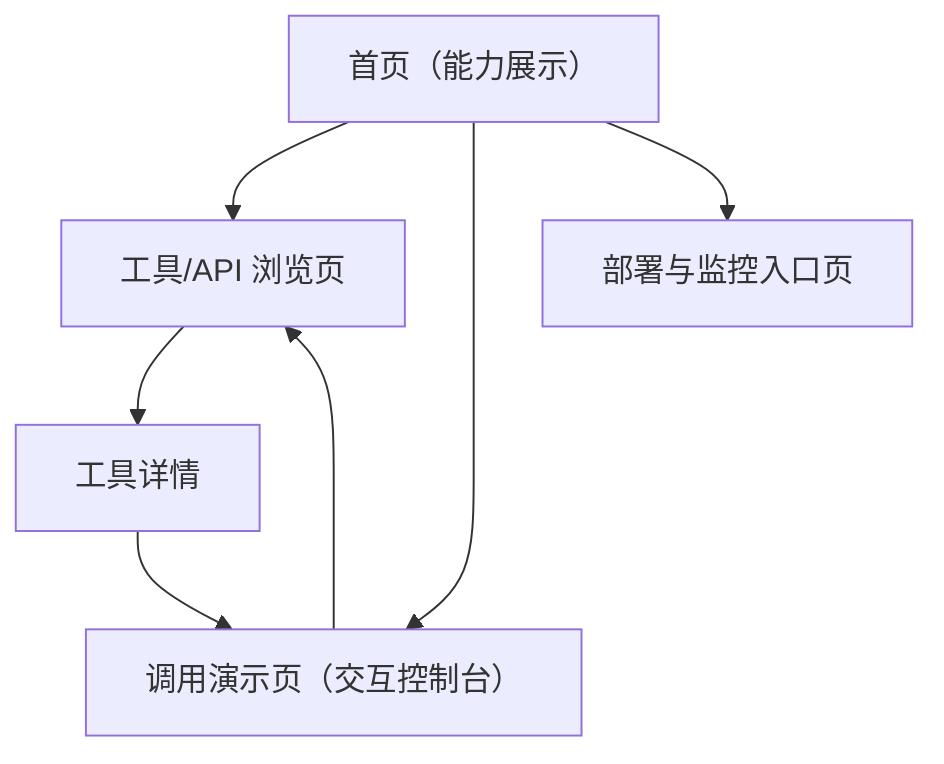

## 1. Product Overview
面向开发者与团队的“工具集门户站”，集中展示工具能力，并提供可交互的 API/工具浏览与调用演示。
同时提供部署与监控的统一入口，便于从体验到上线的闭环。

## 2. Core Features

### 2.1 User Roles
本产品默认无需账号即可使用（如需接入企业内网/权限系统，后续再扩展）。

### 2.2 Feature Module
我们的工具集门户需求由以下页面组成：
1. **首页（能力展示）**：能力概览、分类入口、快速开始。
2. **工具/API 浏览页**：工具列表、筛选搜索、工具详情与参数说明。
3. **调用演示页（交互控制台）**：参数填写、请求发送、结果与日志展示、示例模板。
4. **部署与监控入口页**：部署入口链接、环境信息、监控与告警入口链接。

### 2.3 Page Details
| Page Name | Module Name | Feature description |
|-----------|-------------|---------------------|
| 首页（能力展示） | 能力总览 | 展示工具集定位、核心能力卡片、适用场景简介 |
| 首页（能力展示） | 分类与导航 | 提供工具分类入口与到“浏览/演示/部署监控”的主导航 |
| 首页（能力展示） | 快速开始 | 提供最短路径：选择一个工具 → 进入调用演示（带默认示例参数） |
| 工具/API 浏览页 | 工具列表 | 按分类展示工具/API 条目（名称、简介、标签） |
| 工具/API 浏览页 | 搜索与筛选 | 按关键字、分类、标签筛选列表结果 |
| 工具/API 浏览页 | 工具详情 | 展示工具说明、Endpoint/方法、参数定义、返回字段说明、示例请求/响应 |
| 调用演示页（交互控制台） | 参数编辑器 | 以表单/JSON 两种视图编辑请求参数并校验必填项 |
| 调用演示页（交互控制台） | 调用执行 | 选择环境（如默认/自定义 Base URL）、发送请求、显示请求耗时与状态 |
| 调用演示页（交互控制台） | 结果与日志 | 展示响应 Body、Headers、错误信息与可复制的 cURL/Fetch 代码片段 |
| 调用演示页（交互控制台） | 示例模板 | 一键填充常见示例参数（来自工具详情页或内置样例） |
| 部署与监控入口页 | 部署入口 | 提供部署相关入口链接（如部署平台/流水线/配置中心的跳转入口） |
| 部署与监控入口页 | 监控入口 | 提供监控相关入口链接（如日志、指标、链路、告警的跳转入口） |
| 部署与监控入口页 | 环境信息 | 展示当前环境标识、版本号/构建信息与健康状态（可选：仅展示静态信息） |

## 3. Core Process
- 体验与探索流：你进入首页了解工具集能力 → 进入工具/API 浏览页筛选并查看某工具详情 → 跳转到调用演示页自动带入示例参数 → 发起调用并查看结果/日志 → 将可复制代码片段带回你的项目。
- 上线与运维流：你从导航进入部署与监控入口页 → 跳转到部署入口完成发布 → 跳转到监控入口查看运行状态与告警。

