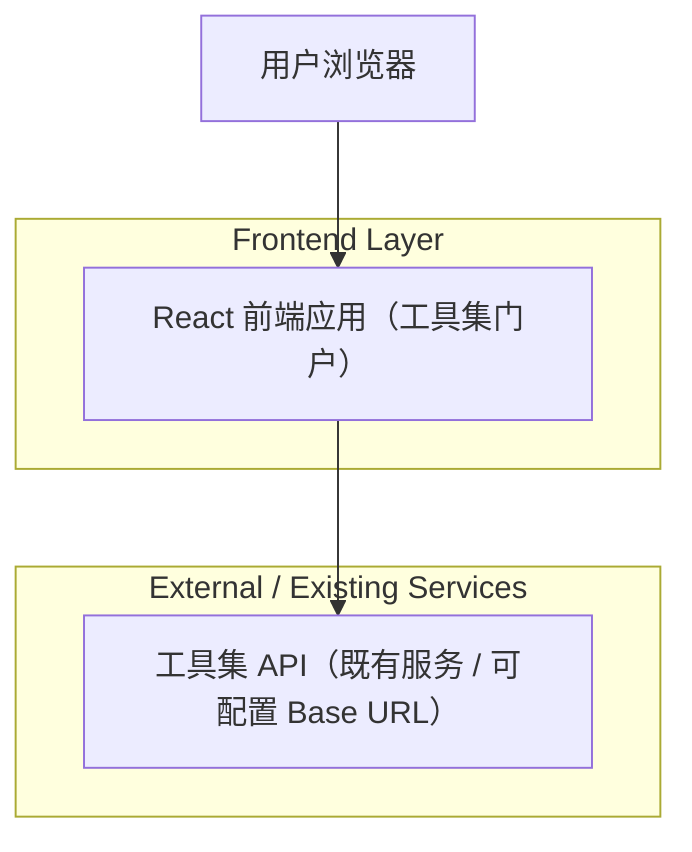

## 1.Architecture design

## 2.Technology Description
- Frontend: React@18 + TypeScript + vite
- UI: tailwindcss@3（用于快速搭建控制台与卡片布局）
- Backend: None（默认直接调用既有工具集 API；如未来涉及密钥托管/鉴权，再引入轻量服务端）

## 3.Route definitions
| Route | Purpose |
|-------|---------|
| / | 首页，展示工具集能力与入口导航 |
| /tools | 工具/API 浏览页，列表+筛选+跳转详情 |
| /tools/:toolId | 工具详情页，参数/返回/示例说明 |
| /playground/:toolId | 调用演示页，交互式请求构造与结果展示 |
| /ops | 部署与监控入口页，统一跳转与环境信息 |

